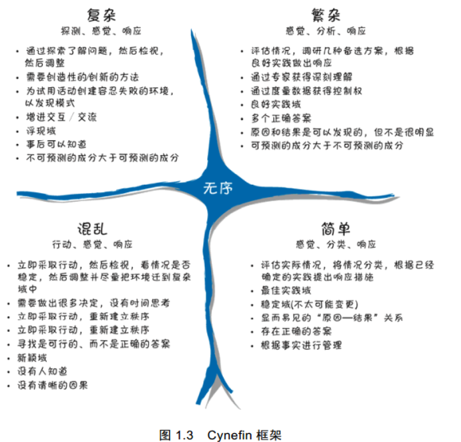

# 第三章敏捷原则读后感
---我们为什么要用Scrum，我们是否应该采用Scrum

作者：周亮

我们在应用Scrum来作为软件开发方式的过程中，很多组织是被动接受的，采用scrum的决定可能是一些领导或者管理层的决定，团队也许接触过一些Scrum 的培训，了解些Scrum方面的基础框架，但是很多时候只是被动的适应，甚至自然会与目前的传统开发方式进行比较，提出质疑。这一章试图以对比描述的方式，把两种开发方式的理念进行对比，从而更好地理解SCRUM 原则，更好地理解SCRUM。而不是把Scrum完全凌驾于其他软件开发方式之上，孰优孰劣地去看待，而是站在软件开发各个生命周期，各种问题场景上去全面地看待Scrum。

在一些被动选择Scrum 的团队，他们可能会忽视这个问题，我们为什么要用Scrum，是否应该采用Scrum？这样的后果体现在一些具体Scrum实践活动中他们会质疑Scrum的方式，甚至执行不好会对Scrum产生负面认识。

要回答这个问题，不妨理解一下Scrum是解决什么类型问题的？自我认识一下目前团队所面对的问题主要是什么范围的问题，书中提到采用Cynefin 框架，这个框架是一个很有意义的框架， 可以帮助我们更好地理解我们工作的环境并确定适合于这种环境的方法。 **这个框架定义并比较了 5 种不同域的特征：简单（Simple）、复杂（Complex）、混乱（Chaotic）、繁杂（Complicated）以及无序Disorder），指的是不知道自己处于哪个域。我将使用 Cynefin 框架讨论 Scrum 非常适合以及不太适合的情况。**

软件开发和支持活动的很多方面都不可能只是与某一个 Cynefin域相吻合。软件开发工作的内容很丰富，各方面有所重叠，各个活动可能属于不同域（Pelrine 2011）。因此，虽然大多数软件开发工作属于复杂域或繁杂域，但如果冒失地说软件开发活动是一个复杂域，未免太幼稚，特别是，如果我们定
义的软件开发活动包含从创新的新产品开发、 现有软件产品的维护到运营与支持等各种工作，情况就更是这样了。

作者还提到从软件整个生命周期里面去审视软件开发，产品新开发阶段处在复杂域，慢慢地，产品框架逐渐成熟，团队也逐渐成熟，一些人成长为专家之时，软件开发的不确定性慢慢减少，可预测性逐渐增加，问题域开始过度到繁杂域，直到软件产品进入维护阶段时，不再有大规模开发，问题变得有张可循，这时候还可能进入简单域。

目前团队大部分经历软件周期是从新产品开发到大规模开发，重点关注复杂域及繁杂域问题的特点。

**复杂域**

在处理复杂问题时，事情不可预测的成分大于可预测的成分。如果存在正确答案的话，我们也只能事后知道。这是涌现域。我们需要在研究之后才能认识问题，然后根据我们的认知来检视与调整。在复杂域中工作时，需要采取创造性的、创新的方法。常规、轻而易举的解决方案是不适用的。 我们需要为试验活动建立一个容忍失败的环境，以便发现重要信息。在这个环境中，大量的互动与交流是必不可少的。创新的新产品开发活动属于这个类别，通过创新的新特性改进已有产品也属于这个类别。
Scrum 特别适合应用于复杂域。在这个环境中，探索（研究）、感知（检视）和响应（调整）的能力非常重要。
感觉互联网领域的软件开发场景，尤其是创新性，颠覆性，新理念，希望快速占领市场的互联网产品对此更适合。

**繁杂域**

繁杂问题是专家控制的良好实践域。可能存在多个正确答案，但是需要专家诊断并找出这些答案。 Scrum 当然能够处理这些问题，但可能不是最优的解决方案。例如，一项性能优化工作需要调整参数
来找出系统的最佳整体性能，这个工作最好能找到专家，让他们评估情况，调研几种备选方案，根据良好实践做出响应。很多日常软件维护（处理一系列的产品支持或缺陷问题）都属于这一类。虽然很多类似于六西格玛等策略性的量化方法也适用于简单域， 但这些方法最适合用于繁杂域。

## 最后思考

对比我们目前从事的软件产品开发,我们目前从事的是电信基站设备大型软件开发，网络中PHY ,MAC协议栈的软件开发有些是根据通信协议标准进行开发，这些通信标准本身是固定的，涉及到一些具体的算法实现，也是有一些通信仿真结果作为参考。虽然整个通信系统很庞大，但是这些问题可预测性，确定性比例应该是大于一些不确定性。因此我理解我们的电信软件开发应该属于繁杂域范畴。当然电信领域也有一些创新性，颠覆性活动，但是这些活动更倾向于预研性质，这种活动应该属于复杂域。所以总体上而言，我们目前商用电信软件产品开发所属范畴，繁杂域范畴居多。

这也能理解我们在产品开发过程中，其实也并行着一些6Sigma 一些项目管理理念。scrum与6 sigma并不冲突，如果所属问题需要，可以去互相吸收各自长处。说到这里，也许可以通过6 sigma 的一些很好工具应用到Scrum 具体活动中，进一步丰富发展Scrum也未尝不可。

回到这个问题，当我们去想为什么要采用Scrum 的时候，不妨先审视下我们目前的软件开发处于哪个生命周期，初始探索阶段，还是成熟阶段，然后用Cynefin 框架分析下我们目前要解决的问题属于哪个域的范畴，是复杂域还是繁杂域还是其他。

当产品处于前期探索阶段，同时所面对的问题又是处于复杂域时，那大胆的听取Scrum 的建议吧，大胆开始采用吧。你会体会到Scrum新活力。

如果我们的产品周期处于成熟阶段，同时我们大部分问题处于繁杂域时，Scrum也还可以的，如果我们也能秉承scrum开放包容的精神去吸收传统成熟开发模式（比如6sigma）一些优秀策略，取长补短，也许会让Scrum如虎添翼

