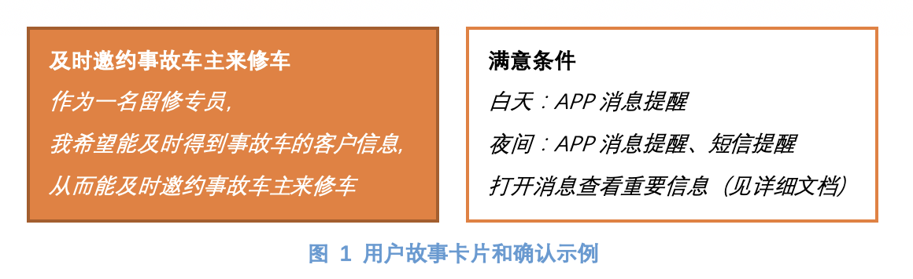

# 第五章 用户故事

作者：王帆

## 前言
有关Scrum的书之前读过几本，感觉《Scrum精髓》是其中最好的啦！对我来说，从厚度和目录来看算是身高和肚腩都最大的了。谢谢Bob的翻译，也谢谢Bob领导了这次有深度的读书活动。

因为是软件工程出身，对Scrum很早就有所认识和尝试。而选择第五章“需求与用户故事”，则是出于产品经理的工作习惯。第五章从93页开始到115页页数，共计23页，属于第一部分“核心概念”。开篇Rubin从与传统顺序开发方式的对比来引出为什么Scrum采用了“用户故事”来表示需求或PBI。然后，全章就在回答以“用户故事”为中心的三个如何：

1.	如何以“用户故事”的方式来为需求创建PBI（Product Backlog Item）占位符；
2.	如何以INVEST标准评价用户故事的优劣势；
3.	如何收集用户故事，重点探讨了用户故事协作研讨会和故事地图。

至此，前言结束，后面就开始聊聊我的收获了。

## 何为用户故事
这里我尽量抽取Rubin原文中的描述：

用户故事是可用于陈述业务价值的一种简便格式，适合各种PBI特别是特性。它结构很简单，为会话提供了一个理想的占位符。此外，可以编写颗粒度不同且易于逐步细化的用户故事。比较直观认识用户故事的方法是3C：卡片（Card）、会话（Conversation）、确认（Confirm）。其中“会话”通常都不是一次性事件，而是持续的深度交谈。

以上是摘自书中对用户故事的定义。Rubin同时也说了，并不是只有用户故事这一种方式来做PBI，也有不方便的时候。确实是这样的，实践UML时用的就是用例（Use Case）。他们之间的异同网上还是有不少讨论的，其中给一个Scrum的牛人还写了篇文章“Why I still use use cases”，名字叫Alistair Cockburn——《敏捷软件开发》和《编写有效用例》两本书的作者:-)。

## 概念和方法
因为并不想把读后感写成拆书，这里只会摘录重要的知识点原文，以对未读过原文的朋友有所帮助。那么这读后感我会写什么？
先回答一下。读这些内容的时候，我不由自主的会联想到自己已知的一些概念、方法，在稍作整理之后我决定写入读后感中。另外，跟“听过很多道理为什么还是过不好这一生”一样，Rubin讲的这些做是方法和原则背后的“道”是啥？我也想从心态层面说说自己的感想，因为在实际工作中我们总会遇到交错的或教科书所没有提及的问题，面对混乱、压力的时候容不得我们去回忆书本。上“道”儿，用适合的心态面对这一切会更好。

### 方法一：金字塔原理
巴巴拉·明托的金字塔原理是一项层次性、结构化的思考、沟通技术，可以用于结构化的写作过程（百度百科）。呵呵，其实Rubin写这本书和我写此读后感也都在用此技术，做需求分析和细化的过程也是如此。
第五章中体现金字塔原理最突出的地方在于两点：

- INVEST原则的Independent原则，独立；
- 收集方法之一的“故事地图”。

其实这两点合到一起有点MECE（Mutually Exclusive Collectively Exhaustive）的意思。当然，故事地图不一定要穷尽，更重要的价值在于“**把主题沿着时间线展开，将工作流中通常较为早发生的主题置于较晚发生的主题的左侧。……有了工作流作为上下文，我们可以进一步确定自己是否遗漏与工作流有关的重要故事。……故事地图结合了已用户为中心的设计和故事分解这两大概念。好的故事地图从用户的视角展示活动流，并为理解单个故事及其与整个故事价值之间的故事系提供了背景信息。**”

有关独立性，我在从事软件设计和需求分析的工作中就已经非常注意，学习OOD里的“对象”和UML里的“用例”都是非常有帮助的。做到独立性在很多时候并不容易，常常是个相对概念，站在不同的层面、角度会有所不同。按照书里的说法应该尽量避免故事间的相互依赖。但如何才能做到呢？这里可以参考的方法之一就是金字塔原理了:-)。

在书中第102页“详细程度”小节中，有一个分三层的图5.5“用户故事的抽象层级结构”，表达的意思与UML的“结构化用例”里的“包含”、“泛化”、“扩展”有些相似，也能被金字塔原理所解释。Rubin对三个抽象层级的故事分别叫：史诗、主题、冲刺故事，而Jeff Patton的“故事地图”里则叫：活动、任务、子任务。

### 方法二：短期聚焦
本人记性不太好，因此我会使用TODO LIST来记录我要做的事情，感觉就像是PBI占位符，这样我就可以专注于“事到临头”的任务，而不用惦记着后面的事情。这个占位符对于其他相关人也非常重要，我们老板总是会担心他提到的需求在“漫长”的产品开发过程中被漏掉，就希望产品设计阶段统统都弄上，有了PBI给他看，自然也就能安抚他了。当我们用用户故事创建了PBI占位符，就可以选择优先级较高PBI开始细化：

- 有了“短期”的时间约束，能使将要完成的PBI限定在一定的数量范围内，如果任务不够小到能在短期内完成，除了风险之外也会缺乏节奏感，应该进一步分解——这里其实就在遵循INVEST原则的Small；
- 聚焦，对于产品负责人来说，除了自己外，还要分别展开面向不同角色的沟通来将问题和目标变得清晰、细致，以创建出符合INVEST的用户故事。当我们把足够的精力专注在小的、少的PBI上时，就容易做到INVEST的Valuable、Estimable、Testable——通过有深度的对话、确认。

### 方法三：价值驱动
似乎没啥好说的，这个大家都知道，但在实践中确实有些疑惑的地方。INVEST规则中的Value，在第五章的原文“有价值”结尾处有这样一段话：有价值标准的关键在于，列表中所有故事都必须是由产品负责人以客户与用户代言人的身份认可它们的价值（也即值得为之投入）。不是所有的故事都是独立的，也不是所有的故事都是完全可协商的，但它们必须都是有价值的。好想鼓掌。

这部分解释了我一直有些疑问的话题，就是有关技术方面的任务是否应该放入PBI。我的理解，首先，需要让产品负责人理解并认同，再者，这个技术任务的失败是否会导致客户价值的损失。所以，书中“迁移到新版Oracle”就可以放入产品列表，而“自动构建”则不能。
当然，很可能更常见的纠结在于“产品负责人”这个角色不固定。一是本身就权责不清晰，比如当项目经理和产品经理同处一室、老板还远程操控时；还有就是某些事情似乎跨在了Title是“产品经理”的权限、能力范围边界时。也许还有其它情况。这时候我想就靠人品和沟通能力了。总的来说，有人的地方就有江湖（浆糊）:-)。

### 方法四：积极协商
OMG，这个简直是能让一切成为可能的法宝。第五章几乎从头到尾都在谈“协商”。“概述”里说“Scrum中，需求细节是在开发期间持续不断的对话中商讨出来的，而且是等到团队开始构建功能的时候，及时、刚好地细化这些需求为团队提供支持”。因为“事实上，在开发创新产品时，拼工时拼勤奋也无法事先搞定完整的需求或设计。总有些需求和设计只在产品开发进行中才会逐渐明现；前期工作再全面，工作量再大，都无法避免这种情况”，我在补充一下，那就是大多数时候我们都没那么多时间去做全面的设计，而不到产品开始使用了，客户也发现不了与自己想法、感受不一样的东西。

原文里Robin特意强调了，需求创建的是PBI占位符，代表客户期待的一个业务价值，最开始的大块业务价值细节很少，是必须要通过和客户协商来搞清楚的，而在细化拆解后，依然需要和开发协商工作量、难度等。因此好的用户故事里有个标准是Negotiable（可协商），“可协商性有助于当事人避免在使用详尽的前期需求文档时常见的彼此推诿、相互职责的心态”。凭良心说，这太TMD重要了，常常遇到的情况是：客户想要的和需要的不一致、产品设计没写清楚的开发按自己感觉做，如果大家在“可协商”这方面有共识，就能减少与期待不一致或浪费开发时间的问题。

总结，需求是协商的参考物，或者说是“用于引导大家对特性达成共识”的工具，在Scrum里便是写成用户故事，这也就是“对话”是用户故事里的要素的原因。

### 方法五：明确目标
我在这里想说的明确目标大概包含这几个意思：

- 用户故事要素之一的：确认；
- INVEST标准里的：Valuable、Evaluable、Testable。
明确目标是我们常挂在嘴边的话，但在实际做产品的时候，也许是因为忙、因为信任，或者因为侥幸，我们会或多或少的忽略目标的明确性。准备就绪的好的用户故事应当是经过多次协商，确认了价值、范围、时间和检查项的PBI。我的感觉，目标不明确很多时候可能是因为：
- 目标不单纯，比如考核到底是针对工作完成度，还是工作效果；
- 程度未量化，比如按贡献给客户分级，贡献多少衡量标准是什么；
- 范围没界定，比如书中举得例子，支持的图片格式都有哪些。
应该还有别的吧，暂时就想到这些。有点像个立体空间的圆锥体，分别代表方向、周长、高度。有关如何评估做到可评估、可测试书中其它章节好像有介绍。继续看吧。

## 心态层面
联想到的概念和方法说了一堆，但工作经验告诉我其实做到并不容易，很多事似乎很努力的刻意为之也没达到预期的目的。在阅读第五章的时候，Rubin的话常常让我想起自己经常提醒自己的事情。

- 接纳变化
虽然我们常常说“这个世界唯一不变的就是变化”，可真的变化降临到自己身上并非总能泰然面对，不接纳就会有抵触，一旦产生情绪就很难去好好协商了。无论是客户的想法、开发团队反馈的问题，还是市场环境的变化，都是一种“跟我想的不一样”的状态，而接纳变化其实就是不以自我为中心的心态，这样即使跟“我”想的不一样也没关系了。只有从心态上“接纳变化”，用户故事的可协商性、对话要素才变得有意义。

- 慢慢来最快
记得上CSPO时候同桌的一个哥们说，我们常常是老板先拍了个不靠谱的DEADLINE，然后再做需求分析、产品设计、软件设计、开发、测试，哪有什么商量的时间。其实这种情况不光老板，我们自己对自己也常常如此。后来发现，要么达不到预期的质量，要么不得不延期才能满足预期的任务量。慢慢来最快，就是逐步细化、专注当前冲刺故事。

- 谦虚和好奇心
想当然和自以为是可能是做产品最要不得的状态，在我看来基本上就失去了和产品相关人、团队甚至自省的机会。虽然我们常常说沟通需求时需要一些谈话技巧，可内心的谦虚和好奇是使用这些技巧的前提，否则就算提问也常常是反问。也恰恰是谦虚好好奇，我们才能坐下来去倾听为什么客户会改变想法、为什么开发希望多问一些细节，毕竟不耐烦的神态和表情是很难掩盖的。

- 善意正直
善意和正直是信任三大要素中的两个（另一个是能力）。这是在前段时间参加一次有关信任的引导沙龙时学到的。善意，代表你真正关心对方的利益；正直，则是你会遵守自己和共同的承诺。说的通俗点，善意和正直有点像我们平时所说的负责的工作态度和没有坏心眼。甲方和乙方、产品负责人和开发团队之间因为站位不同，一定存在意见不同、思维方式不同的情况，彼此之间存在信任才是持续深度协商的基础，善意和正直可以装，但很难一直装。保持这个，并不与钱冲突。

## 结语
虽然感觉有些只言片语无从说起，但写到这里也说的差不多了。但从第五章来看，Rubin这本书确实写的很好，有关用户故事的创建、评价、收集不仅仅讲述了方法，更用大量文字说明了原因，从头到尾感觉到坦诚和用心，让我再一次体会了Scrum的五个价值观：承诺、专注、开放、尊重、勇气。承诺排在第一！！
